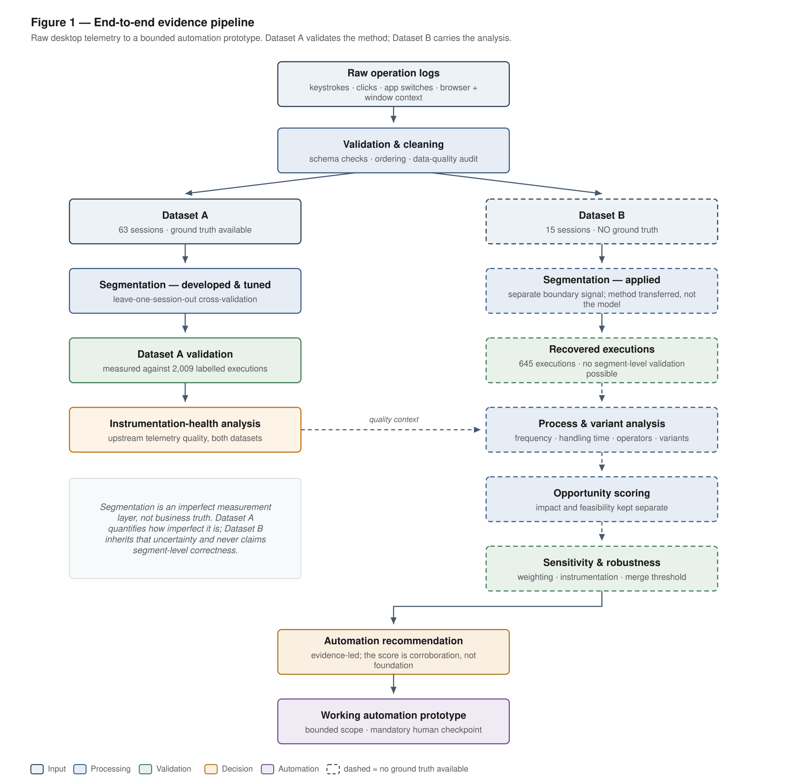
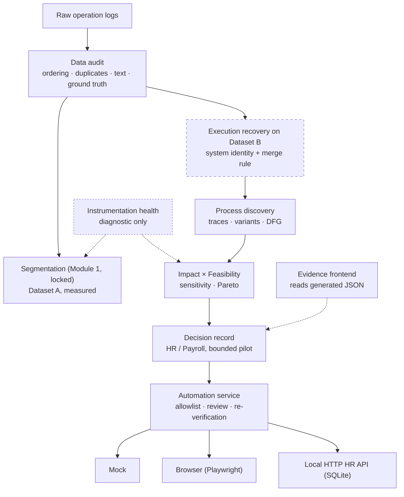

# From Operation Logs to an Automation Proposal

**Vivek Badgujar** · IIT Goa, Computer Science and Engineering · vivek303323@gmail.com
/vivek.badgujar.24031@iitgoa.ac.in

**Start with the [final report](reports/final_report.md).** This README explains what is in
the repository and how to run it. The daily reasoning, including what failed, is in the
[work log](work_log.md). The task as issued is kept unchanged in
[docs/assignment_brief.md](docs/assignment_brief.md).

---

## 1. Problem

A desktop agent records every keystroke, click and application switch made by back-office
staff, but nothing in the log says which business process is running. Management wants to
know where automation would have the greatest impact, and to see something that works.

Four things make it hard: work is not contiguous, the same process repeats with different
data, the same process does not always follow the same steps, and unrelated activity is
mixed in. Dataset A (63 sessions) has ground truth; Dataset B (15 sessions), the data to
analyse, does not.

## 2. What I built

```
raw logs → data audit → execution reconstruction → process discovery
        → opportunity analysis → decision with evidence → bounded automation prototype
```

- **A data audit** that found ordering, duplication, screenshot and redaction problems
  before anything was built on the data.
- **A segmentation pipeline** (Module 1), designed and measured on Dataset A and locked
  after pre-registered gates.
- **Process discovery and ranking** on Dataset B: traces, variants, a directly-follows
  graph, Impact × Feasibility scoring, sensitivity, ablation and a Pareto check.
- **A bounded HR / Payroll automation**: deterministic UI steps, a mandatory human review
  before every confirmation, a Playwright browser adapter, and audit and failure handling.
- **An evidence frontend** that shows every step of the investigation from generated JSON,
  without recomputing anything.



*Dataset A validates the method; Dataset B carries the analysis. Dashed borders mark stages
with no ground truth.*

## 3. Key results

| Result | Value |
|---|---|
| Dataset A | 63 sessions, 162,768 events, ground truth |
| Dataset B | 15 sessions, 20,477 events, no ground truth |
| Segmentation (Dataset A) | Boundary (transition-level) F1 **0.3440** — precision 0.2358, recall 0.6355; 79.05% of ground-truth executions still contain a false split |
| Dataset-B executions | **645** (`segments.jsonl`) |
| Processes | 29 contexts: 21 ranked, 8 excluded |
| Selected process | **HR / Payroll System** — 122 executions, all 4 operators |
| Dominant path | **94/122 = 77.05%** of HR executions (55.89% of HR handling time) |
| Opportunity (canonical) | **0.4401** (Impact 0.9236 × Feasibility 0.4765) |
| Robustness | #1 in 5 of 8 weighting scenarios; worst rank 3; Pareto non-dominated |
| Instrumentation | 8/63 Dataset-A and 2/15 Dataset-B sessions flagged |
| Module 2 | Not promoted: +0.0102 F1 against +0.0200 required |
| Status | Validated on local targets only; not connected to a real HR system |

The F1 is a boundary metric over transitions, of which only about 1% are true boundaries. It
is not a segmentation accuracy, and it is a weak result.

## 4. Why HR / Payroll

Not because it has the highest score. Because these facts line up:

- the largest share of recorded handling time (32.5% across the ranked processes) and the
  highest Impact of all candidates;
- done by all 4 recorded operators, while the workbooks that outrank it under some
  weightings are used by one and three;
- 94 of 122 executions follow one short path through four known routes, with the note
  pasted rather than typed; the exceptions (24 Word detours, 4 rare cases) are
  identifiable and left to a person;
- DOM-level evidence for every step, and no judgement step inside the dominant path;
- it stays first when instrumentation-degraded sessions are removed (645 → 571 executions).

It is **not** the most feasible process (Feasibility 0.4765 against 0.92–0.95 for two Excel
workbooks), and the composite score is fragile: at the median merge threshold a
7-execution workbook takes first place. Handling time and operator coverage held at every
threshold tested, so the score is corroboration, not the foundation.

## 5. What actually runs

| Component | What it does | Classification |
|---|---|---|
| `src/procmine/automation/hr_payroll_automation.py` | Route allowlist, note validation, element checks, human review checkpoint, confirm-time re-verification, safe stops | Core automation |
| `scripts/serve_hr_demo_api.py` | Local automation API (Python standard library): request and execution ids, state machine, status lookup, development roles, redacted audit | Production-shaped, local only |
| `MockHRApplication` | Deterministic in-memory HR target | Demo / mock |
| `BrowserHRApplication` | Playwright driving a real Chromium page against the local HR prototype page | Local browser integration |
| `scripts/serve_local_hr_api.py` | Separate local HR API simulator over HTTP with SQLite state | Demo / mock, real HTTP |
| `frontend/` | React evidence application and the HR demo screen | Presentation only |

None of these targets is a real HR system.

## 6. Demo (about five minutes)

```bash
# terminal 1 — automation API on 127.0.0.1:8000
python scripts/serve_hr_demo_api.py

# terminal 2 — data bundle and frontend on http://localhost:5173
python scripts/build_frontend_data.py --out frontend/public/data
cd frontend && npm install && npm run dev
```

If port 8000 is taken, start the API with `--port 8123` and the frontend with
`VITE_API_TARGET=http://127.0.0.1:8123 npm run dev`.

| Minute | Screen | What to look at |
|---:|---|---|
| 0–1 | **Executive Dashboard** | The decision, the limitations beside it, and the investigation progress |
| 1–2 | **Day 1 · Data Audit**, **Day 2 · Reconstruction** | What was wrong with the data; every segmentation attempt, the trade-off chart, and why the baseline was kept |
| 2–3 | **Day 3 · Process Mining**, **Day 4 · Evidence Health** | Where the work concentrates, the HR evidence and flow, and why some sessions fail |
| 3–4 | **Automation Decision Center**, **Opportunities**, **Approach Comparison** | The decision record, the ranking with its Pareto view, and the rejection log with Module 2 |
| 4–5 | **HR Automation Demo** | Prepare a note, see REVIEW REQUIRED, approve, and read the audit result; then try an empty note to see a SAFE STOP |

Optional, the same journey over real HTTP to the local HR API simulator:

```bash
python scripts/serve_local_hr_api.py                   # 127.0.0.1:8100
HR_API_BASE_URL=http://127.0.0.1:8100 python scripts/serve_hr_demo_api.py
# in the demo: choose LOCAL HTTP INTEGRATION, then "Stage HTTP lost-response demo"
```

Command-line demos: `python scripts/run_hr_payroll_automation_demo.py --out reports/day3`
(mock target) and `python scripts/run_hr_browser_demo.py --out reports/day7` (real Chromium;
add `--headed` to watch).

## 7. Architecture



The automation service depends only on the `HRApplication` interface, so every target runs
the same safety logic. The frontend never computes an analytical value;
`scripts/build_frontend_data.py` copies them from the artifacts.

## 8. Segmentation

Boundary-first classification split 90.64% of true executions. A continuity-first model on
its own was worse (94.69%). What worked better was combining both classifiers' candidates,
removing candidates with continuity rules, and protecting the real boundaries those rules
wrongly removed.

| System | F1 | Recall | Fragmented | Under-seg. | Decision |
|---|---:|---:|---:|---:|---|
| Pause-only rule | 0.1729 | 0.3525 | — | 0.2127 | Reference |
| V1 boundary-first | 0.2534 | 0.6547 | 90.64% | 0.0850 | Failed |
| V2 continuity-first | 0.2397 | 0.7032 | 94.69% | 0.0625 | Failed |
| Candidates + rules | 0.3037 | 0.5200 | 77.57% | 0.2043 | Superseded |
| **+ combined protection** | **0.3440** | **0.6355** | **79.05%** | **0.1412** | **Locked** |
| C2 rule + continuity veto (Day 7) | 0.2822 | 0.2980 | 40.87% | 0.6606 | Rejected |

Later challengers — an HMM, two ensembles, four simpler rules and Module 2 — all failed.
Every approach that lowered fragmentation did it by merging work. Details:
[reports/day2/segmentation_architecture_final.md](reports/day2/segmentation_architecture_final.md)
and [reports/day7/segmentation_improvement_analysis.md](reports/day7/segmentation_improvement_analysis.md).

## 9. Process mining

645 executions → 29 contexts → 21 ranked processes. The 8 excluded contexts total 77
executions and 0.1220 h; HR alone is 0.8309 h, so no exclusion can change the answer.

| Rank | Process | Impact | Feasibility | Opportunity |
|---:|---|---:|---:|---:|
| 1 | HR / Payroll System | 0.9236 | 0.4765 | **0.4401** |
| 2 | Order & Inventory Management | 0.6699 | 0.5267 | 0.3529 |
| 3 | Excel: Budget Analysis | 0.3542 | 0.9544 | 0.3380 |
| 4 | Financial Accounting System | 0.8802 | 0.3695 | 0.3252 |
| 5 | Excel: Expense Calculation | 0.3452 | 0.9221 | 0.3183 |

The audit found and fixed one real bug (entropy compared in raw bits). The Opportunity score
is a prioritisation model, not a monetary estimate. Details:
[reports/day3/problem2_process_mining_analysis.md](reports/day3/problem2_process_mining_analysis.md).

## 10. Automation

**Automated:** open one of the four evidenced routes, check the note field, insert the
operator's note, check the OK button, stop for review, re-locate the button, confirm.

**Manual:** writing the note, approving every confirmation, the Word detours (24 executions,
33.9% of HR time), rare multi-hop cases, and handling safe stops.

Why deterministic UI automation: no API call appears in the logs, and the dominant path has
no judgement step for an AI agent to handle. Details:
[reports/day3/hr_payroll_automation_prototype.md](reports/day3/hr_payroll_automation_prototype.md).

## 11. Module 2

**Experimental extension — not promoted.**

Module 2 added operator-normalised timing and on-screen content drift to Module 1's inputs.
Its best configuration reached F1 0.3519 against a matched control of 0.3417: a gain of
**+0.0102** where **+0.0200** was required before any candidate was scored. It lowered
fragmentation (76.94%) and passed seven of eight gates, but the gate was not lowered after
the fact. Module 1 stays canonical, and no downstream number changed.

A blind Dataset-B screenshot review drew 40 points; all 40 have a screenshot reference, but
only 26 image files exist. A vision model reviewed those 26 and **identified concerns**. It
is a surrogate review, not ground truth; no human review was performed. Details:
[reports/day6/module_comparison_final.md](reports/day6/module_comparison_final.md) and
[reports/day6/module2/dataset_b_screenshot_review_results.md](reports/day6/module2/dataset_b_screenshot_review_results.md).

## 12. Safety and production boundary

Implemented and tested: route allowlist; note validation before any UI contact;
single-element checks; a server-side review checkpoint with a single-use token;
confirm-time re-verification; safe stops that keep the partial action log; development roles
in which an operator can prepare but not confirm; a redacted audit log that stores the
note's length, never its text; idempotency by execution id on the local HTTP target.

**Lost confirmation response.** If a confirmation commits but its response is lost, the
execution becomes `UNKNOWN` and the client asks
`GET /api/executions/{execution_id}/status` instead of retrying. This is settled only for
the local simulators; a real deployment needs reconciliation against the real system of
record.

Still required before any real use: the real HR system and driver environment, enterprise
authentication, secrets management, owner confirmation that OK means "submit", a
governance review for payroll data, reconciliation by `execution_id`, and TLS with service
identity. Details:
[reports/day6/production_integration_extension.md](reports/day6/production_integration_extension.md).
Configuration variables are listed in `.env.example`; no secrets are committed.

## 13. Testing

| Check | Result |
|---|---|
| Python tests (`pytest -q`) | 1,130 passed, including 19 real-browser tests |
| Frontend tests (`cd frontend && npx vitest run`) | 262 passed |
| Typecheck (`npx tsc -b`) | clean |
| Production build (`npm run build`) | 352.67 kB JS (99.57 kB gzip), 37.27 kB CSS |
| Report traceability (`python scripts/verify_report_numbers.py`) | 75/75 |
| Browser QA | every screen at 1440, 1024 and 390 px: no horizontal overflow, no console or network errors; demo, safe stop and replay checked against the local API |

The browser tests skip automatically if Chromium is not installed
(`playwright install chromium`).

## 14. Reproducibility

Requires Python 3.10 or newer, Node 18 or newer, and the raw `dataset_a/` and `dataset_b/`
folders, which are not in the repository.

```bash
python -m venv .venv && source .venv/bin/activate
pip install -r requirements.txt
pytest -q

# Step 1: Dataset-A validation (reproduces F1 0.344023)
python scripts/run_protected_boundary_experiment.py --dataset dataset_a --out reports/day2
# Step 1 output: Dataset B -> 645 executions -> segments.jsonl
python scripts/build_process_executions_dataset_b.py --dataset dataset_b --out reports/day3
python scripts/build_segments_jsonl.py --day3-dir reports/day3 --out segments.jsonl
# Step 2: ranking and its audit
python scripts/analyze_process_priority_dataset_b.py \
    --executions reports/day3/process_executions_dataset_b.json --out reports/day3
python scripts/audit_problem2_process_mining.py --day3-dir reports/day3 --out reports/day3
# Robustness and challenges
python scripts/run_recommendation_sensitivity.py --dataset dataset_b --out reports/day7 --work-dir /tmp/day7
python scripts/run_segmentation_improvement_experiment.py --dataset dataset_a \
    --out reports/day7 --baseline reports/day2/protected_boundary_experiment_dataset_a.json
# Frontend bundle, figures and the report check
python scripts/build_frontend_data.py --out frontend/public/data
python scripts/generate_report_figures.py --out reports/figures
python scripts/verify_report_numbers.py
```

The analysis is deterministic, and the data bundle rebuilds byte-identically apart from its
timestamp. The full command list, including Module 2 and the HTTP integration, is in
Appendix D of the [final report](reports/final_report.md).

## 15. Repository structure

```
reports/final_report.md          the submission
work_log.md                      day-by-day reasoning, including what failed
segments.jsonl                   Step 1 deliverable (645 records)
docs/assignment_brief.md         the task as issued

reports/day1 … day7/             evidence for each day
reports/figures/                 report figures (SVG and PNG)

src/procmine/audit.py, loaders/  data audit and loading
src/procmine/segmentation/       locked Dataset-A pipeline (Module 1)
src/procmine/process_discovery/  Dataset-B analysis and scoring
src/procmine/instrumentation_health.py   Day-4 diagnostic
src/procmine/experiments/        Day-6/7 challengers, isolated from the locked path
src/procmine/module2/            Module 2, experimental
src/procmine/automation/         HR automation, mock, browser adapter, audit
src/procmine/integrations/       API boundary, execution state, local HTTP integration
scripts/                         one script per experiment or deliverable
frontend/                        React evidence application
tests/                           Python tests
```

## 16. Reports and evidence

| Question | Where |
|---|---|
| What was wrong with the data? | [reports/day1/data_quality_report.md](reports/day1/data_quality_report.md) |
| How was segmentation built and locked? | [reports/day2/segmentation_architecture_final.md](reports/day2/segmentation_architecture_final.md) |
| What work happens in Dataset B? | [reports/day3/process_discovery.md](reports/day3/process_discovery.md) |
| Why HR, and how robust is it? | [reports/day3/problem2_process_mining_analysis.md](reports/day3/problem2_process_mining_analysis.md), [reports/day7/recommendation_sensitivity.md](reports/day7/recommendation_sensitivity.md) |
| What is the HR evidence? | [reports/day3/hr_payroll_dominant_path_analysis.md](reports/day3/hr_payroll_dominant_path_analysis.md) |
| Why do some sessions fail? | [reports/day4/instrumentation_health_analysis.md](reports/day4/instrumentation_health_analysis.md) |
| How does the frontend stay honest? | [reports/day5/data_contract.md](reports/day5/data_contract.md) |
| What was challenged and rejected? | [reports/day6/day6_experiments.md](reports/day6/day6_experiments.md), [reports/day6/module2/module2_final_decision.md](reports/day6/module2/module2_final_decision.md), [reports/day7/work_thread_reconstruction_analysis.md](reports/day7/work_thread_reconstruction_analysis.md) |
| Is the learned model used for the decision? | No — [reports/day7/model_card.md](reports/day7/model_card.md) |

## 17. Limitations

- Segmentation is imperfect: boundary F1 0.3440, 79.05% of executions fragmented.
- Dataset B has no ground truth, so its segments are compared, never scored.
- The Opportunity score is fragile, and the 77.05% share depends on the merge threshold.
- No monetary ROI can be estimated: the logs carry no cost or production volume.
- "OK = submit" is inferred from the DOM; the 139/138 click mismatch is unexplained.
- Note content is not observable, so a person always supplies it.
- The automation runs on local targets only; lost responses are settled only for the local
  simulators.
- The Dataset-B visual review is a vision-model surrogate with 14 of 40 images missing.
- Module 2 was not promoted.

## 18. AI assistance

Generative AI tools were used as implementation and analysis accelerators for code
scaffolding, debugging, test generation, documentation drafting, and exploration of
hypotheses. Engineering decisions, experiment scope, acceptance/rejection criteria,
interpretation of evidence, safety boundaries, and final conclusions were reviewed and
directed by the author. The [work log](work_log.md) records the split day by day.


## 19. Final takeaway

The logs cannot perfectly reconstruct business work, and this project does not claim they
can. What it offers is a defensible path from imperfect operational evidence to a bounded
automation proposal: HR / Payroll's dominant path, automated deterministically under human
review, with the uncertainty stated and the safety controls tested. The next step is a
supervised pilot on one route, not full automation.

## 20 Project Walkthrough

A complete walkthrough of the project explaining the end-to-end workflow, including:

- Dataset inspection and data-quality analysis
- Dataset A process segmentation
- Segmentation experiments and validation
- Dataset B process discovery
- Automation opportunity analysis
- HR / Payroll candidate selection
- Evidence and robustness analysis
- Automation prototype and safety boundaries
- Human review and safe-stop mechanism
- Execution lifecycle and `UNKNOWN` state
- Production-readiness boundary
- Rejected approaches and final engineering decisions

👉 **[Watch the Complete Project Explanation Video](https://drive.google.com/file/d/1kbpBh02UAvG8f8YVZrKRyxey86qL8WB-/view?usp=sharing)**
