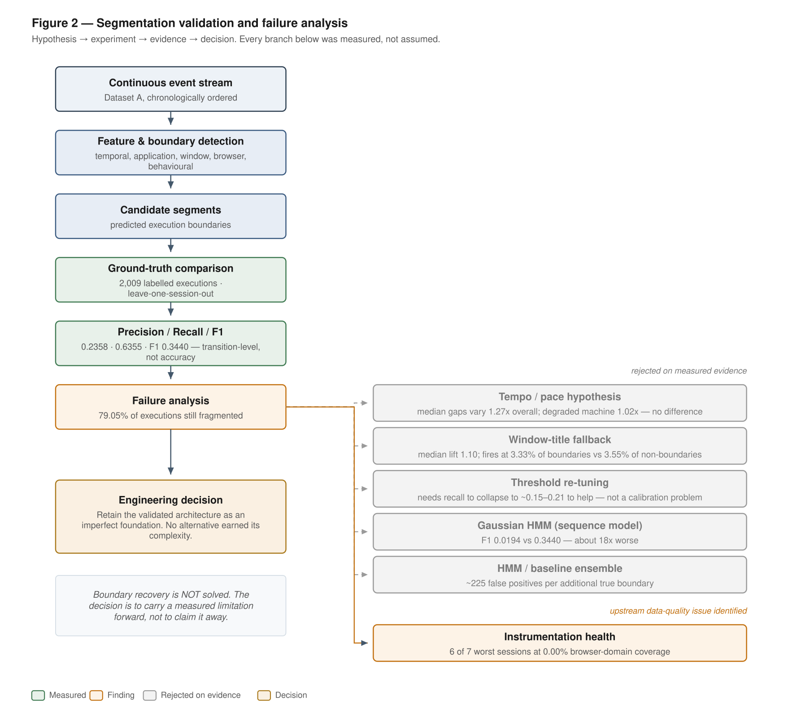
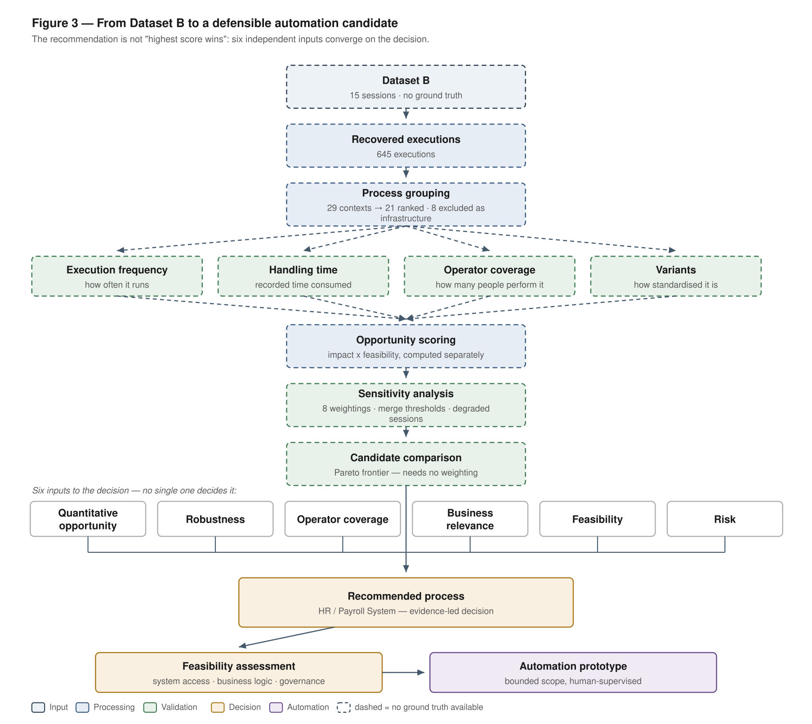
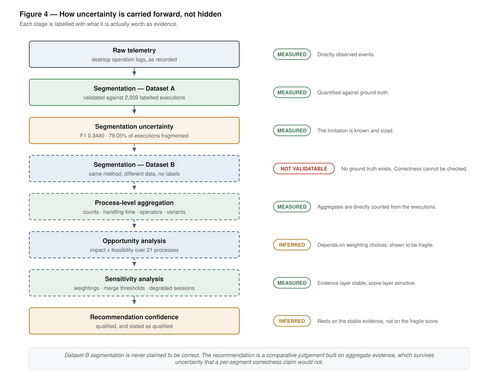
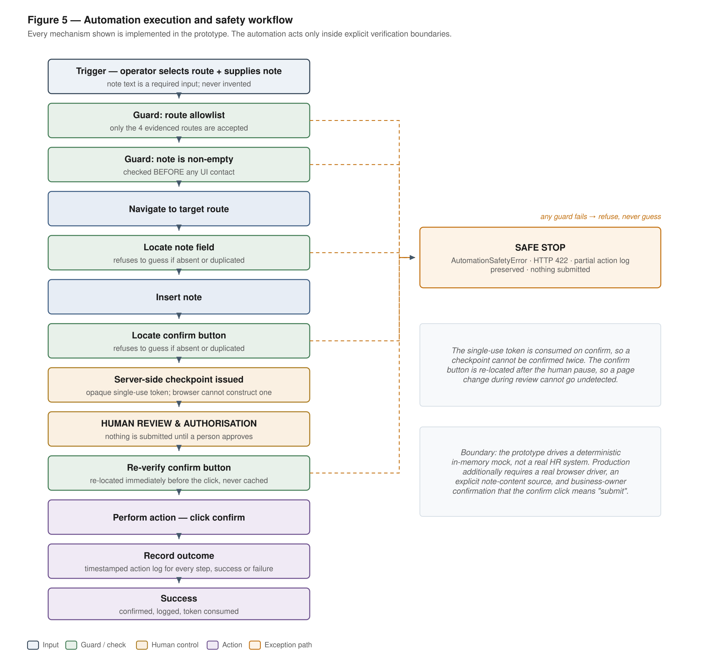

# From Operation Logs to an Automation Proposal — Final Report

**Candidate:** Vivek Badgujar (IIT Goa, CSE)
**Datasets:** A (63 sessions, 162,768 events, ground truth) · B (15 sessions, 20,477 events, no ground truth)

---

## 1. Executive summary

The client asked where automation would have the greatest impact, and to be shown something
that works. The logs contain only keystrokes, clicks and application switches, so the work had
to be reconstructed before it could be analysed.

My recommendation is to **automate the dominant path of the HR / Payroll System first, as a
bounded, deterministic UI automation with a human review before every confirmation, starting
with a single-route pilot.** HR / Payroll carries the largest share of recorded handling time,
all four recorded operators do this work, and most of its executions follow one short,
repeated path through four known screens. The Opportunity score agrees, but I treat it as
corroboration rather than as the reason (§7.3).

**At a glance**

| Item | Result |
|---|---|
| Dataset A | 63 sessions · ~162k events (162,768) · ground truth for every session |
| Dataset B | 15 sessions · ~20k events (20,477) · no ground truth |
| Step 1 approach | Continuity-first reconstruction, locked after pre-registered gates |
| Step 1 quality on Dataset A | Boundary (transition-level) F1 **0.3440**; precision 0.2358, recall 0.6355; 79.05% of ground-truth executions still contain a false split |
| Step 1 output on Dataset B | **645** executions in `segments.jsonl` |
| Selected process | **HR / Payroll System** — 122 executions, 7 distinct variants, all 4 recorded operators |
| Automation scope | Dominant deterministic path: **94/122 = 77.05%** of HR executions (55.89% of HR handling time), 4 evidenced routes |
| Opportunity (canonical) | **0.4401** = Impact 0.9236 × Feasibility 0.4765 |
| Robustness | #1 in 5 of 8 weighting scenarios, worst observed rank 3, Pareto non-dominated |
| What was built | Deterministic, bounded UI automation with mandatory human review, a Playwright browser adapter, and audit and failure handling |
| Module 2 | Experimental extension, **not promoted** (+0.0102 F1 against +0.0200 required) |
| Status | Prototype validated locally (mock, local browser page, local API simulators). Not connected to a real HR system. |

The boundary F1 is a transition-level metric over a population in which only about 1% of
transitions are true boundaries. It is not a segmentation accuracy, and it is a weak result
that I report as a limitation. **Not claimed:** hours saved, monetary ROI, production
readiness, or any segmentation quality for Dataset B, which has no ground truth.

Evidence labels: **OBSERVED** (counted in the logs), **DERIVED** (arithmetic on observed
values), **INFERRED** (a reading that could be wrong), **ASSUMED** (my judgement) and
**CANONICAL** (read from a locked artifact).


**Figure 1. End-to-end evidence pipeline.** Dataset A validates the segmentation method
against ground truth; Dataset B carries the business analysis, where no segment-level
validation is possible (dashed borders). Instrumentation health is a data-quality input, not
a segmentation rule. *(Vector version: `figures/01_end_to_end_pipeline.svg`.)*

---

## 2. The business question

Back-office staff move between internal web systems and Excel or Word all day. Three
constraints shaped every decision:

- **Only operations are recorded.** Nothing says which business process is running, so units
  of work must be recovered first (Step 1).
- **Dataset B, the data to analyse, has no ground truth.** Any claim about it has to survive
  without labels.
- **The logs come from a test environment with shortened waiting times**, so processes are
  compared with each other, not judged by absolute durations.

A useful answer needs a defensible way to recover work, a comparison of processes that does
not hang on one fragile number, and an automation whose scope stops where the evidence stops.

---

## 3. Data and data quality

I audited both datasets before building anything on them.

| | Dataset A | Dataset B |
|---|---:|---:|
| Sessions / chunk files | 63 / 117 | 15 / 20 |
| Events | 162,768 | 20,477 |
| Sessions spanning 2+ chunk files | 53 of 63 | 5 of 15 |
| Screenshot references resolving to a file | 7.2% (2,489 of 34,580) | 81.2% (~3,865 of 4,759) |
| Ground truth | 63 of 63 sessions | none |

| Finding (OBSERVED) | Consequence |
|---|---|
| Raw order is not chronological in any session (15,231 inverted pairs in A); 68% of near-simultaneous inversions involve an asynchronous screenshot | Loaders sort by `timestamp_ms`; chunk edges are never boundaries |
| 443 events (0.27%) have `ms_since_last_event` below −1,000 ms (minimum −713,900 ms, where an event names the wrong chunk) | Pauses are recomputed from sorted timestamps |
| 32,876 of the 33,232 sequential duplicates in A are `app_switch` (about 65% of all `app_switch`); 42 `browser_error` groups are double-logged | Reported, not deleted; collapsing repeats is a Step-1 decision |
| 116 of 118 `text_input_complete` events carry content; every clipboard payload is empty | Pasted content is unobservable, so the operator supplies the note |
| 2,009 executions rebuilt from `gt.jsonl` with 0 manifest mismatches; one abandoned suspension exists only in the raw stream | Ground truth is used for evaluation, never as pipeline input |
| 18 password-field `text_input_complete` events hold plaintext although `redact_password_fields: true` (synthetic test credentials) | No value is reproduced anywhere; governance risk (§16) |

---

## 4. Step 1 — Recovering units of work

### 4.1 Initial hypothesis

A unit of work should end where the operator pauses or changes context. Early signal checks
found browser navigation to be the strongest boundary cue (lift 13.98); window-title changes
(0.048) and clipboard timing (0.008) carried almost no boundary information. Pause-based rules
became the reference floor (§4.4).

### 4.2 What failed

A learned **boundary-first** classifier (V1) split 90.64% of true executions and was *more*
confident on its false internal boundaries (median p 0.960) than on real ones (0.932), because
mid-task pauses (median 2,627 ms) are longer than typical real boundaries (526 ms). No
threshold fixed it: fragmentation of 73–79% needed recall to collapse to about 0.15–0.21.

### 4.3 Turning point: from boundary-first to continuity-first

I reframed the question as "does the current execution continue?". The continuity-first
classifier (V2) alone fragmented even more (F1 0.2397 on the full-session basis used below,
0.270 on labelled transitions only). What worked was to stop trusting either classifier
alone: take their candidates together, remove candidates with demote-only continuity rules,
then protect the real boundaries those rules wrongly removed.

### 4.4 Experiments

All rows use the same full-session evaluation (1,752 ground-truth executions with a recorded
end, 1,671 true boundaries); the two rule baselines report no fragmentation figure.

| Approach | F1 | Recall | Fragmentation | Under-seg. | Decision |
|---|---:|---:|---:|---:|---|
| Pause-only rule (gap > 3 s) | 0.1729 | 0.3525 | — | 0.2127 | Reference floor |
| Pause and context change | 0.1816 | 0.3303 | — | 0.2571 | Reference |
| V1 boundary-first classifier | 0.2534 | 0.6547 | 90.64% | 0.0850 | Failed: fragmentation |
| V2 continuity-first classifier | 0.2397 | 0.7032 | 94.69% | 0.0625 | Failed: fragmentation worse |
| Design 2: candidate union + demotion rules | 0.3037 | 0.5200 | 77.57% | 0.2043 | Promising; under-segmentation too high |
| + agreement protection | 0.2522 | 0.6810 | 92.98% | 0.0752 | Rejected: 3 of 7 gates failed |
| + tempo protection | 0.3393 | 0.6433 | 79.85% | 0.1332 | Passed every gate; not selected |
| **+ combined protection (locked)** | **0.3440** | **0.6355** | **79.05%** | **0.1412** | **Locked as Module 1** |
| Day 6: unsupervised HMM | 0.0194 | 0.2220 | 98.29% | 0.0421 | Rejected |
| Day 6: ensemble, either model flags | 0.0586 | 0.7295 | 98.80% | 0.0143 | Rejected |
| Day 6: ensemble, both must agree | 0.1500 | 0.1281 | 34.36% | 1.2265 | Rejected |
| Day 6: Module 2 (M2C) | 0.3519 | 0.6338 | 76.94% | 0.1452 | NOT PROMOTED (§13) |
| Day 7: C1 two-threshold rule | 0.2245 | 0.3160 | 66.50% | 0.3893 | Rejected |
| Day 7: C2 rule + continuity veto | 0.2822 | 0.2980 | 40.87% | 0.6606 | Rejected |
| Day 7: C3 rule + process motif | 0.2493 | 0.2998 | 54.45% | 0.4976 | Rejected |
| Day 7: C4 instrumentation-aware rule | 0.2256 | 0.3148 | 65.58% | 0.3959 | Rejected |

Combined protection was chosen over tempo, which also passed every gate, because it was never
worse on fragmentation in any of the 63 sessions and kept its F1 edge across the threshold
neighbourhood.

**What the later challenges showed.** The HMM fired on 22.5–46.9% of transitions against a
true rate near 1%; it uniquely found 157 true boundaries, but an ensemble paid about 225 false
positives for each extra one. The four Day-7 rules, fitted leave-one-session-out against gates
registered before scoring, all failed and trace one curve: every point that lowers
fragmentation raises under-segmentation. C2 cuts fragmentation from 79.05% to 40.87% only by
raising under-segmentation from 0.1412 to 0.6606, so it merges executions rather than
segmenting better. The full stack is still worth a 53% relative improvement over a tuned
two-threshold rule (0.3440 against 0.2245).

**Decision: RETAIN LOCKED SEGMENTATION.** The locked baseline reproduces at drift 0.0,
so every downstream artifact stayed valid and nothing was regenerated.



**Figure 2. Segmentation validation and failure analysis.** Each rejected branch was measured
before it was dropped. The locked foundation is validated but imperfect: boundary recovery is
not solved.

### 4.5 The locked pipeline

Candidate set V1∪V2 → four demote-only rules (noise override, leave-and-return, cluster,
10-event continuity fallback) → combined protection. Four global thresholds (0.9078,
0.8860, 0.40, 4680.2613), all Dataset-A fitting leave-one-session-out.

| Precision | Recall | **Boundary (transition-level) F1** | Over-seg. | Under-seg. | Fragmented |
|---:|---:|---:|---:|---:|---:|
| 0.2358 | 0.6355 | **0.3440** | 1.6033 | 0.1412 | 79.05% |

**Transfer to Dataset B.** Dataset B has different applications and almost no long gaps, so
the Dataset-A classifiers were not carried over. It is segmented on changes of the active
system (from window titles), with leave-and-return trips of at most 5 events merged back; a
first attempt on the often-empty `browser_domain` produced thousands of near-empty segments
and was replaced. Result: **645 executions** in `segments.jsonl`, each labelled by its
dominant system context.

### 4.6 Limitations, and why Step 2 went ahead anyway

79.05% of ground-truth executions still contain a false boundary, and Dataset-B segmentation
cannot be checked at all. Step 2 went ahead because its question is comparative and it reads
aggregates (counts, handling time, operator coverage, variant shares) that tolerate internal
splits far better than per-execution claims. Day 7 tested that argument (§7.3); the one
execution-level analysis, the HR forensics (§8), is corroborated by DOM-level evidence.

---

## 5. Instrumentation health (Day 4)

The worst Dataset-A sessions clustered on one machine, so I checked whether the logs rather
than the algorithm were at fault, using two signals that need no ground truth: browser-domain
coverage (threshold 0.40, in the gap between 26.00% and 46.42%) and distinct browser domains
(threshold 2).

- **Dataset A: 8/63 flagged**, including all 7 sessions of one machine; **Dataset B: 2/15.**
  On healthy sessions 96.6% of true boundaries coincide with a domain change; on the degraded
  machine, 0%.
- Against "poor session" (F1 below the healthy 5th percentile): 8 true positives, 0 false
  positives, **2 false negatives** (well-instrumented sessions, so missing capture is not the
  only cause of poor segmentation) and 53 true negatives.
- **Flagged sessions merge work rather than split it** (median under-segmentation 1.2462
  against 0.0921).

The tool is **diagnostic only**: it never changes the canonical segmentation, and its
Dataset-A thresholds cannot be checked on Dataset B. Without the two flagged Dataset-B
sessions (645 → 571 executions), HR stayed first, Pareto non-dominated and first in 5/8
scenarios, with Opportunity 0.4180 instead of 0.4401. **0.4401 is the canonical figure; 0.4180
belongs only to this check.** A third value, 0.4186, is superseded (a pre-entropy-fix
artifact) and is never used.

---

## 6. Step 2 — Process discovery

**Method.** Executions are grouped by dominant system context: 29 contexts, of which 21 are
ranked business processes and 8 are excluded (terminal, file dialogs, Teams, Explorer,
unresolved browser ports). All 8 exclusions together are 77 executions and **0.1220 h**; HR
alone is 122 executions and 0.8309 h, so HR is 6.8x larger than every exclusion combined.
For every ranked process I built traces (the ordered systems an execution touches), variants,
a directly-follows graph and operational metrics. Scoring keeps two quantities apart until
the end:

- `Impact_p = mean(norm(FS_p), norm(TS_p), norm(manual_p))` — frequency share, time
  share, manual-event share.
- `Feasibility_p = mean(norm(C_p), 1-norm(H_norm_p), norm(AS_p), 1-norm(risk_p))` —
  dominant-variant share, low normalised variant entropy, automation surface
  (`AS_p = dominant_variant_share × avg_manual_event_share`), low complexity risk.
- `Opportunity_p = Impact_p × Feasibility_p`, with equal weights and min-max
  normalisation across the 21 processes.

An audit found one real bug: entropy was used in raw bits, which is not comparable across
processes with different variant counts. Normalising by `H/H_max` moved HR's Feasibility
from 0.453 to 0.477 and swapped ranks 4 and 5.

| Rank | Process | Impact | Feasibility | **Opportunity** |
|---:|---|---:|---:|---:|
| 1 | HR / Payroll System | 0.9236 | 0.4765 | **0.4401** |
| 2 | Order & Inventory Management | 0.6699 | 0.5267 | 0.3529 |
| 3 | Excel: Budget Analysis | 0.3542 | 0.9544 | 0.3380 |
| 4 | Financial Accounting System | 0.8802 | 0.3695 | 0.3252 |
| 5 | Excel: Expense Calculation | 0.3452 | 0.9221 | 0.3183 |



**Figure 3. From Dataset B to an automation candidate.** The Opportunity score is one of six
inputs to the decision, alongside robustness, operator coverage, business relevance,
feasibility and risk. Every stage upstream of the decision is dashed: Dataset B has no ground
truth.

---

## 7. Why HR / Payroll

### 7.1 The evidence chain

HR was not chosen because it has the highest score. It was chosen because these facts line
up:

1. **Volume and time.** 122 executions (close to Financial Accounting's 125) and the largest
   share of recorded handling time: 32.5% across the 21 ranked processes (0.8309 h). Its
   Impact, 0.9236, is the highest of all candidates.
2. **People.** HR is done by all 4 recorded operators (18, 25, 44 and 35 executions); the
   workbooks that outrank it under some weightings are used by one and three.
3. **Repetition.** 7 distinct variants, but **94 of 122 executions (77.05%)** stay inside the
   HR system; the rest are 24 Word detours (19.7%) and 4 rare multi-hop cases (about 3.3%).
   The directly-follows graph puts the heavy cross-application traffic on the Word detour
   (33 HR → Word and 32 Word → HR transitions).
4. **Interaction evidence.** Four routes with a note field and an OK button; every observed
   form input is a paste (§8).
5. **Not the most feasible.** Feasibility 0.4765 against 0.92–0.95 for the Excel workbooks;
   HR wins on Impact, not on ease.
6. **Score and robustness.** Opportunity 0.4401, ahead of 0.3529, and #1 in 5 of 8 weighting
   scenarios. The three that displace it all reduce the weight on time, and dropping duration
   from Impact moves HR to rank 3 (count and duration correlate at 0.977).
   Worst observed rank across everything tested: 3.
7. **Pareto.** With no weights at all, only 3 of 21 processes are non-dominated, and HR is
   one of them.

### 7.2 What would change the answer

Production volume. Every case in which a small workbook overtakes HR depends on that
workbook's tiny volume carrying no weight. The pilot in §18 is designed to measure it.

### 7.3 Robustness under segmentation uncertainty (Day 7)

§4.6 argued that the business analysis survives weak boundaries. On Day 7 I tested that by
re-running the whole Step-2 chain at four leave-and-return merge thresholds (percentiles of
the away-span distribution), with everything else fixed. Threshold 5 reproduced the canonical
ranking exactly.

| Threshold | Executions | Top candidate | HR rank | Kendall τ | HR handling time | HR operators |
|---:|---:|---|---:|---:|---:|---:|
| 0 | 1,018 | HR / Payroll System | 1 | 0.7905 | 0.7635 h | 4 |
| **5 (locked)** | **645** | **HR / Payroll System** | **1** | **1.0000** | **0.8309 h** | **4** |
| 11 | 479 | Excel: Budget Analysis Workbook | 5 | 0.7778 | 0.8684 h | 4 |
| 36 | 262 | HR / Payroll System | 1 | 0.4559 | 0.9796 h | 4 |

**The result was not the comfortable one.** At the median threshold HR falls to rank 5,
displaced by a workbook with 7 executions and one operator whose Feasibility normalises to
1.0000, so the composite score is **fragile** (`C. SENSITIVE`). The evidence underneath did
not move: HR is the largest consumer of handling time and is done by all four operators at
every threshold (`A. STABLE`). The recommendation stands; the score is corroboration, not
foundation. The scope figure is also threshold-dependent (dominant-path share 100%, 77.05%,
53.33% and 33.33% at thresholds 0, 5, 11 and 36), so "77.05% of executions" describes one
segmentation choice, not a fixed property of the work.



**Figure 4. How uncertainty is carried forward.** Each stage is tagged MEASURED, INFERRED or
NOT VALIDATABLE. Aggregate process evidence stayed stable across every merge threshold
tested; the weighting-dependent Opportunity score did not.

---

## 8. HR / Payroll forensic analysis

DOM-level evidence from the 94 dominant-path executions (OBSERVED):

- **Four evidenced routes** — `#/payroll-items`, `#/onboarding`, `#/leave-applications`,
  `#/social-insurance` — each with a note field and an OK button. `#/resident-tax` and
  `#/dashboard` are visited but show no note-and-confirm pattern, so they are excluded.
- **Paste only:** all 134 observed form inputs are pastes.
- **Near-1:1, not exact:** 139 note-field clicks against 138 OK clicks; the gap sits on
  `#/leave-applications` (27 against 26) and is unexplained.
- **No submit event exists.** Reading OK as "confirm" is **INFERRED** from the DOM, which is
  why a human review precedes every confirmation.
- **Word detours are excluded:** 24 executions that open procedure documents and take 33.9%
  of HR handling time.
- **A judgement step exists.** An LLM labelling pass on compressed summaries (no raw logs)
  matched the withheld process names 6/6 and noted that one route asks for
  「承認コメントまたは差戻し理由」 ("approval comment or reason for return"), which supports
  keeping a person in the loop.

---

## 9. Step 3 — The prototype

```
operator ─► Frontend (React, presentation only)
             │  POST /api/prepare · POST /api/confirm · GET /api/executions/{id}/status
             ▼
           Automation API (Python stdlib http.server)
             ids · execution state machine · development roles · redacted audit
             ▼
           HR automation service (procmine.automation)
             route allowlist · note and element checks · ReviewCheckpoint · safe stops
             │  HRApplication interface
   ┌─────────┼──────────────────┬──────────────────┐
   ▼         ▼                  ▼                  ▼
 Mock app  Browser adapter     In-process API     HTTP adapter ─► local HR API
 (memory)  (Playwright ─►      simulator                          (SQLite, :8100)
           local HR page)
```

| Layer | Components | Classification |
|---|---|---|
| Automation logic | `hr_payroll_automation.py`: route allowlist, note and element checks, `ReviewCheckpoint`, confirm-time re-verification, safe stops, the `HRApplication` interface | **CORE AUTOMATION** |
| Targets | `MockHRApplication`; the local HR prototype page (`reports/day3/hr_payroll_mock_app.html`); the in-process and local HR API simulators; the demo screen | **DEMO / MOCK** |
| Service boundary | Automation API (request and execution ids; state machine PREPARED → AWAITING_CONFIRMATION → CONFIRMING → CONFIRMED / FAILED / UNKNOWN; opt-in SQLite state; development roles; redacted audit; error taxonomy; status endpoint), the HTTP adapter (idempotent by execution id) and the Playwright browser adapter | **PRODUCTION-SHAPED**, local only |

**Flow:** navigate → verify note field → insert the operator's note → verify OK button →
**human review checkpoint** → re-locate the OK button → confirm.

**Safety properties, each tested:** the note is required and empty notes are refused before
the UI is touched; only the four evidenced routes are accepted; exactly one note field and one
OK button must exist; the checkpoint is held server-side with a single-use token and cannot be
confirmed twice; the OK button is re-located at confirm time; safe stops return HTTP 422 with
the partial action log; and the audit stores the note's length, never the note.



**Figure 5. Execution and safety workflow of the prototype.** Every mechanism shown is
implemented and tested, and any failed guard refuses rather than guesses.

I chose **one deep, evidenced automation over a general multi-process framework**: the
evidence for HR is DOM-level, while for the other 20 processes it is aggregate only.

---

## 10. Why deterministic UI automation

| Option | Decision | Reason |
|---|---|---|
| **Deterministic UI automation** | **Chosen** | The dominant path is a stable, repeated, click-driven sequence in one web system |
| API integration | Rejected | No API call appears anywhere in the logs; building one would mean inventing an interface |
| AI agent / LLM in the loop | Rejected | The dominant path has no unstructured or judgement step to automate; a model would add non-determinism and audit difficulty |
| Workflow tool (n8n, Power Automate) | Rejected | Needs the same system access as UI automation, plus a platform dependency, with no evidence of integration points |
| Automate every HR variant | Rejected | Word detours and rare cases need document lookups and judgement the logs cannot describe |
| General multi-process framework | Deferred | Only HR has the interaction-level evidence a safe automation needs |

---

## 11. What remains manual

- **Writing the note.** Its content is not observable in the logs.
- **Reviewing and approving every confirmation.** By design, not as a gap.
- **Word detours** (24 executions, 33.9% of HR handling time) and **rare multi-hop
  cases** (4 executions).
- **Anything after a safe stop.** The automation refuses rather than guesses, so a person
  must own the exception path.
- **Outcome checks when a confirmation's result is unknown** on targets that have no
  status source (§15).

---

## 12. Realistic impact

The logs support estimating relative opportunity and automation coverage. They do not support a defensible dollar ROI without production labor-cost and case-value information.

What the automation covers, within this sample (DERIVED):

```
HR total recorded handling time         2,991,209 ms   (49.9 min, 122 executions)
Dominant path (automation scope)        1,671,931 ms   (27.9 min,  94 executions)

Share of HR executions covered          94/122 = 77.05%
Share of HR handling time covered       55.89%
```

These are different numbers on purpose. The detours take two to six times longer per
execution, so "77% automated" would overstate the time benefit by about 21 points. The
honest ceiling for this scope is about 56% of observed HR handling time, before the human
review that remains. Both figures also depend on the merge threshold (§7.3).

A real estimate would need:

```
effort reduction = production execution volume          [unknown]
                 × automatable share of handling time   [0.5589 in this sample]
                 × automation success rate              [unknown — pilot]
                 × (1 − remaining review time)          [unknown — pilot]
```

---

## 13. Module 2 — additional evidence, tested and not promoted

Module 2 added **operator-normalised timing** and **content drift** (token overlap of on-screen
text) to Module 1's inputs, ran them through the locked evaluator, and compared the result
with a control using the same threshold rule. Eight hypotheses were tested:

| # | Hypothesis | Verdict |
|---|---|---|
| H1 | Operator-normalised timing | Weak: operator median gaps span only 52–56 ms |
| H2 | Content drift | Right direction, but computable on 11.50% of transitions |
| H3 | Dataset-B screenshot review | Surrogate review only; identifies concerns |
| H4 | Effort conversion | Hours computed; the monetary half is impossible |
| H5 | Operator variant concentration | Not supported (χ² 1.152 against 7.815) |
| H6 | Pareto frontier | Reproduced exactly (3 of 21); a communication aid |
| H7 | Pre-flight variant routing | Admits 62/122 executions and 0 of 28 non-dominant ones |
| H8 | Post-action audit | Detects injected route drift; never proof of a business record |

| | Module 1 | Module 2 |
|---|---|---|
| Status | Canonical, locked | Experimental |
| F1 | 0.3440 (canonical) · 0.3417 (control, same threshold rule) | 0.3519 (best configuration) |
| F1 gain used by the gate | — | **+0.0102** over the control |
| Required gain (registered before scoring) | — | **+0.0200** |
| Fragmentation | 79.05% | 76.94% |
| Decision | Retained | **NOT PROMOTED** |

**Module 2 reduced fragmentation in the best experimental configuration, but the F1 gain
did not meet the pre-registered promotion gate, so Module 1 remains canonical.** The gain was
broad (30 of 63 sessions higher, 8 lower) and passed seven of eight gates, but it was too
small, and lowering the bar afterwards would have fitted the gate to the result. This is a
negative result, not a failure: better instrumentation matters more than more features.

**Dataset-B visual review.** A fixed seed (20260918) drew 40 points: 20 predicted
boundaries and 20 mid-execution controls, mixed blind.

- Sampled points with a screenshot reference: 40/40 (median gap 385 ms).
- Screenshots physically available: 26/40. 14 of the 40 sampled image files are missing
  from the delivered dataset. Every capture chunk
  above 250 screenshots holds exactly 250 files, and the cause is not determinable.
  That left 26 reviewable points.
- Judgments on those 26: clear continuity 7, clear boundary 6, ambiguous 13; unavailable
  14. Visible context changes were no more common at predicted boundaries (3 of 12
  judgeable) than inside executions (3 of 14 judgeable controls), and
  13 of the 26 reviewable points were ambiguous.
- Three predicted boundaries sit in visibly continuous work on one record, each right
  after a short Word lookup that the 5-event merge limit turned into its own execution.

**Decision: identifies concerns.** The reviewer was a vision model, so this is a **surrogate
review, not ground truth**: its judgments were hashed before the answer key was read, no human
review was performed, and no Dataset-B segmentation claim follows in either direction.

---

## 14. Browser integration

`BrowserHRApplication` drives a real Chromium page through Playwright, against the local HR
prototype page. It implements the same `HRApplication` interface as the mock, so the
automation service and its safety controls run unchanged, and a test checks that the service
imports no browser, HTTP or database code. **19 browser tests** cover the four routes, invalid
input, missing and duplicate elements, a page change during review, and double confirmation.
It is a local mock page, not a real enterprise system.

---

## 15. Production boundary

| Implemented and tested locally | Required before any real deployment |
|---|---|
| Automation API with request and execution ids | The real HR system URL and a real driver environment |
| Route allowlist and note validation before any UI contact | Enterprise authentication and authorisation |
| Mandatory human review, held server-side; single-use tokens | Secrets management |
| Confirm-time re-verification | Business-owner confirmation that OK means "submit" |
| Structured, redacted audit log; error taxonomy with safe stops | Governance and security review for payroll data |
| Browser adapter; health endpoint | Reconciliation against the real system of record |
| Local HTTP integration: SQLite state, idempotent by execution id, lost responses settled by status lookup | TLS and service-to-service identity |

**Known edge case: a lost confirmation response.** If the HR system commits a confirmation
but the response never reaches the client, the client cannot know whether it landed. Locally,
a confirmation is sent once and never retried, the execution id exists from prepare time, the
execution becomes `UNKNOWN`, and `GET /api/executions/{execution_id}/status` asks instead of
guessing. The local HTTP HR API is idempotent by execution id and settles a lost response on
request, also after a restart when execution state is durable (`EXECUTION_DB_PATH`). Not
proven: the mock and browser targets have no status source, and nothing shows that a real HR
system offers one. Production therefore needs durable execution state and an idempotent
reconciliation endpoint keyed by `execution_id`. Confirmation is intentionally not retried.

---

## 16. Risk register

| Risk | Evidence | Impact | Mitigation | Prototype status |
|---|---|---|---|---|
| Poor instrumentation | 8/63 A and 2/15 B sessions flagged | High | Health diagnostic; sensitivity re-run | Diagnostic built; the capture fix is a client action |
| Incorrect segmentation | F1 0.3440; 79.05% fragmented | High | Aggregate analysis; Day-7 robustness test; DOM corroboration | Accepted, documented |
| Variant drift | 7 variants; dominant share moves with the threshold | Medium | Route allowlist; experimental pre-flight routing gate | Allowlist enforced |
| Unknown note semantics | Note text unobservable; one route takes an approval comment | High | Operator writes the note; review before confirm | Enforced |
| Wrong confirmation semantics | No submit event; OK inferred from the DOM | High | Human checkpoint; business-owner confirmation | Checkpoint enforced; confirmation open |
| Sensitive data exposure | 18 plaintext password-field values in Dataset A; payroll data | High | Counts only; the audit keeps note length, not content | Enforced; governance review open |
| Lost confirmation response | Target commits, response lost | High | No retry; execution id; status lookup; idempotent confirm | Local simulators only |
| Duplicate execution | Retries and replays | High | Single-use tokens; idempotency by execution id | Enforced, tested |
| Authentication and authorisation | Not visible in the logs | High | Development roles now; enterprise identity later | Development only |
| Production UI changes | Selectors are element ids | Medium | Refuse on missing or duplicate elements; re-verify at confirm | Enforced; monitoring open |
| Word detours | 24 executions, 33.9% of HR time | Medium | Excluded; a phase-5 candidate (§18) | Out of scope by design |
| Human approval and governance | Payroll changes need accountable approval | High | Review before every confirmation; audit trail | Enforced locally; sign-off open |
| Dataset B has no ground truth | Surrogate visual review identified concerns | Medium | Comparative conclusions only; robustness test | Accepted, documented |
| Score fragility | Top candidate changes at the p50 threshold | Medium | Decision rests on handling time and operator coverage | Documented |
| Unknown volume and cost | Test environment; no cost data | Medium | No ROI claimed; the pilot measures volume | Open |

---

## 17. How the seven days were spent

"Day N" is a work phase, not a calendar date. The file timestamps span 12–18 September
2026, several phases share a calendar day, and later extensions are filed under the phase
they extend rather than as new days.

| Day | Focus | What did not work, and what changed |
|---|---|---|
| 1 | Data audit and validation | A profiler read the wrong text field (100% "missing" was really 1.7%); ordering, duplicates, screenshots and the password gap reshaped the loaders |
| 2 | Segmentation: build, measure, pivot, lock | Window-title and clipboard signals carried almost no information; boundary-first fragmented 90.64% of executions and thresholds could not fix it; continuity-first alone was worse; combining and protecting gave the locked design |
| 3 | Dataset B, process discovery, prioritisation, prototype | `browser_domain` failed as a boundary signal on Dataset B; the entropy bug changed real ranks; the sensitivity test weakened HR's case (5/8) |
| 4 | Instrumentation health | Tempo and window-title explanations were rejected; the cause was missing browser capture on one machine |
| 5 | Evidence frontend and automation API | Later extended with execution state, status lookup and development roles, all local |
| 6 | Decision layer, HMM, ensemble, clustering, Module 2 | HMM, ensembles and Module 2 were rejected by measurement; the local HTTP integration and the visual review were added as extensions |
| 7 | Robustness, simpler rules, figures, learned component, browser adapter, final documentation | The score proved fragile; four simpler rules failed their gates; the work-thread idea failed both of its preconditions |

**What I would change.** I spent a large share of the time on Step 1, where the brief sets
no accuracy bar. Some later Day-2 forensic detours had diminishing returns; locking earlier
would have left more time for the pilot measurement design.

---

## 18. Next steps

| Phase | Goal | Content |
|---|---|---|
| 0 | Prerequisites | Business owner confirms OK = submit; governance sign-off for payroll data; a real note source; service identity and permissions |
| 1 | Fix the evidence | Restore browser-domain capture on the degraded machine; run the automation in prepare-only mode against a test tenant |
| 2 | Supervised pilot | `#/payroll-items` only (69 of 69 note clicks matched by an OK click); human review of every confirmation |
| 3 | Extend within scope | The other three evidenced routes — 4 routes only, no Word detours, human review kept |
| 4 | Harden | Real driver infrastructure, secrets, durable state, reconciliation by `execution_id`, selector-drift monitoring, audit retention |
| 5 | Next candidates | Word detours as a scripted document lookup with a human check; DOM-level evidence for Order & Inventory |

**Measure during the pilot:** production execution volume; automation success rate;
safe-stop rate by type; unknown-outcome rate; duplicates blocked; human review time;
end-to-end handling time before and after; selector-drift incidents.

---

## 19. Conclusion

The result is not a claim that the logs can perfectly reconstruct business work. The result is a defensible path from imperfect operational evidence to a bounded automation proposal, with explicit uncertainty and safety controls.

HR / Payroll is the strongest evidence-backed candidate in this dataset. I know which
assumptions the recommendation rests on, I tested the ones I could, and the next step is a
controlled pilot, not full automation.

---

## Appendix A — Key metrics

| Metric | Value | Source |
|---|---:|---|
| Dataset A boundary F1 / precision / recall | 0.3440 / 0.2358 / 0.6355 | `reports/day2/protected_boundary_experiment_dataset_a.json` |
| Fragmented / under- / over-segmentation | 79.05% / 0.1412 / 1.6033 | same |
| Dataset-B executions | 645 | `segments.jsonl` |
| Ranked / excluded contexts | 21 / 8 | `reports/day3/process_profiles_dataset_b.json` |
| HR executions, variants, operators | 122, 7, 4 | same |
| HR dominant path | 94/122 = 77.05% | `reports/day3/hr_payroll_dominant_path_dataset_b.json` |
| HR Opportunity / Impact / Feasibility | 0.4401 / 0.9236 / 0.4765 | `reports/day3/problem2_audit_results.json` |
| Pareto; scenarios with HR first; worst rank | 3 of 21; 5 of 8; 3 | same |
| Flagged sessions | A 8/63 · B 2/15 | `reports/day4/instrumentation_health_dataset_{a,b}.json` |
| Module 2 best F1; gain; required | 0.3519; +0.0102; +0.0200 | `reports/day6/module2/module2_promotion_gate.json` |
| Visual review | 40 sampled, 26 available, 14 unavailable | `reports/day6/module2/dataset_b_visual_review_results.json` |

## Appendix B — Experiment and rejection log

Segmentation systems and their decisions are tabulated in §4.4. The other ideas that were
tested and dropped:

| Approach | Result | Decision |
|---|---|---|
| Window-title change signal | Lift 0.048 | Rejected (Day 2) |
| Clipboard timing | Lift 0.008 | Rejected (Day 2) |
| Threshold re-tuning | Needs recall of about 0.15–0.21 | Rejected (Day 2) |
| Interrupted-execution reconnection | 0 of 63 sessions contain a checkable case | Rejected (Day 2) |
| Segment-coherence signals | 0.045–0.107 separation, below the gate | Rejected (Day 2) |
| Global sequence optimisation | 0.080 separation; a segment-length confound | Not built (Day 2) |
| Tempo explains bad sessions | 1.02× against 1.27× spread | Rejected (Day 4) |
| Window-title fallback | Lift 1.10 | Rejected (Day 4) |
| HDBSCAN process clustering | ARI 0.264 behavioural against 0.661 with system identity | Rejected for the pipeline (Day 6) |
| BiLSTM-CRF | 63 sessions cannot support the transfer | Not built (Day 6) |
| LLM semantic labelling | 6/6 agreement with withheld names | Kept in a narrow role (Day 6) |
| Work-thread reconstruction | No interleaved work in the ground truth; linking evidence redundant with timing | Not built (Day 7) |

## Appendix C — Artifact map

| Area | Where |
|---|---|
| Data audit | `reports/day1/` (inventory, full audits, quality, timestamp, text-input and ground-truth reports) |
| Segmentation | `reports/day2/` (`segmentation_architecture_final.md`, `protected_boundary_experiment_dataset_a.json`) |
| Process discovery and ranking | `reports/day3/` (`process_discovery.md`, `problem2_process_mining_analysis.md`, `problem2_audit_results.json`) |
| HR forensics and prototype | `reports/day3/hr_payroll_dominant_path_analysis.md`, `hr_payroll_automation_prototype.md` |
| Instrumentation health | `reports/day4/instrumentation_health_analysis.md` |
| Frontend and data contract | `reports/day5/` |
| Challenges, Module 2, integration | `reports/day6/`, `reports/day6/module2/`, `reports/day6/production_integration_extension.md` |
| Robustness and simpler rules | `reports/day7/recommendation_sensitivity.md`, `segmentation_improvement_analysis.md` |
| Figures | `reports/figures/` |
| Code | `src/procmine/` (audit, segmentation, process discovery, automation, integrations, module2) |

## Appendix D — Reproducing this

Requires Python 3.10 or newer and the raw `dataset_a/` and `dataset_b/` directories. The
README lists the demo and HTTP-integration commands.

```bash
pip install -r requirements.txt && pytest -q
python scripts/run_protected_boundary_experiment.py --dataset dataset_a --out reports/day2   # F1 0.344023
python scripts/build_process_executions_dataset_b.py --dataset dataset_b --out reports/day3
python scripts/build_segments_jsonl.py --day3-dir reports/day3 --out segments.jsonl          # 645 records
python scripts/analyze_process_priority_dataset_b.py \
    --executions reports/day3/process_executions_dataset_b.json --out reports/day3
python scripts/audit_problem2_process_mining.py --day3-dir reports/day3 --out reports/day3
python scripts/run_hr_payroll_automation_demo.py --out reports/day3
python scripts/run_recommendation_sensitivity.py --dataset dataset_b --out reports/day7 --work-dir /tmp/day7
python scripts/run_module2_segmentation_experiment.py --dataset dataset_a \
    --out reports/day6/module2 --baseline reports/day2/protected_boundary_experiment_dataset_a.json
python scripts/score_module2_promotion_gate.py --artifact reports/day6/module2
python scripts/build_frontend_data.py --out frontend/public/data
python scripts/verify_report_numbers.py                                                      # 75/75
```

`scripts/verify_report_numbers.py` checks every headline number in this report against its
artifact and runs as a test, together with guards that the superseded 0.4186 is never shown as
canonical, that F1 is never called accuracy, and that no currency figure appears.

## Appendix E — Test summary

| Suite | Result |
|---|---|
| Python (`pytest -q`) | 1,130 tests pass |
| Browser adapter (real Chromium) | 19 tests pass |
| Frontend (`npx vitest run`) | 262 tests pass |
| Frontend typecheck and build | clean; 352.67 kB JS (99.57 kB gzip) |
| Report traceability | 75/75 |

## Appendix F — AI disclosure

Generative AI tools were used as implementation and analysis accelerators for code scaffolding, debugging, test generation, documentation drafting, and exploration of hypotheses. Engineering decisions, experiment scope, acceptance/rejection criteria, interpretation of evidence, safety boundaries, and final conclusions were reviewed and directed by the author.

The one analytical use is the LLM labelling pass in §8, which received compressed
summaries only, no raw logs and no screenshots, and was checked by hand. The Dataset-B
visual review in §13 was performed by a vision model and is reported as a surrogate, not
as ground truth. The work log records AI use day by day, as the brief asks.

## Appendix G — Known limitations

1. 79.05% of Dataset-A ground-truth executions remain fragmented.
2. Dataset-B segmentation is unvalidated; there is no ground truth.
3. No ROI figure: two of the four terms in §12 are unknown.
4. "OK = submit" is an inference; the human review exists because of it.
5. The 139/138 click discrepancy is unexplained.
6. The prototype drives local targets only, never a real HR system.
7. Business-impact and risk judgements are mine, not measurements.
8. The instrumentation diagnostic detects missing capture only (sensitivity 0.800).
9. DOM-level evidence exists for HR only.
10. The composite Opportunity score is fragile at the p50 merge threshold.
11. The 77.05% dominant-path share is threshold-conditional.
12. The robustness test varied only the merge threshold, at four values.
13. Lost confirmation responses are settled only against the local simulators.
14. The Dataset-B screenshot review is a vision-model surrogate review only; there was no
    human review, and 14 of 40 images are missing.
15. Module 2's segmentation was not promoted; its routing gate and post-action audit
    remain experimental.
